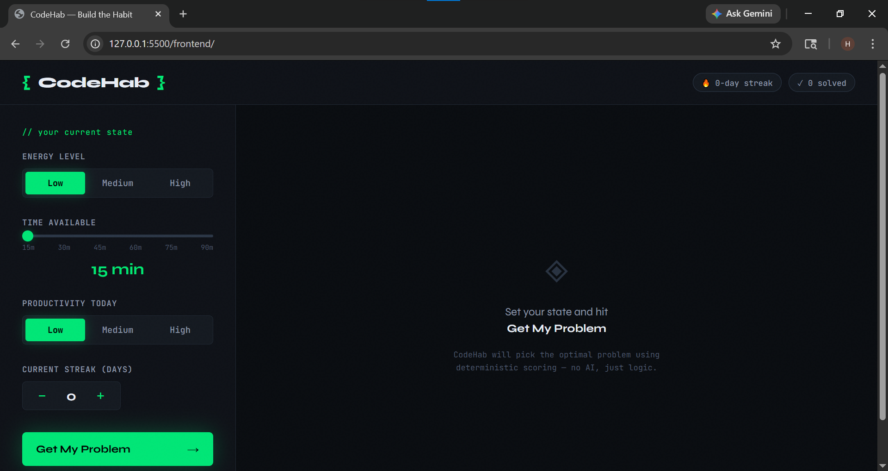
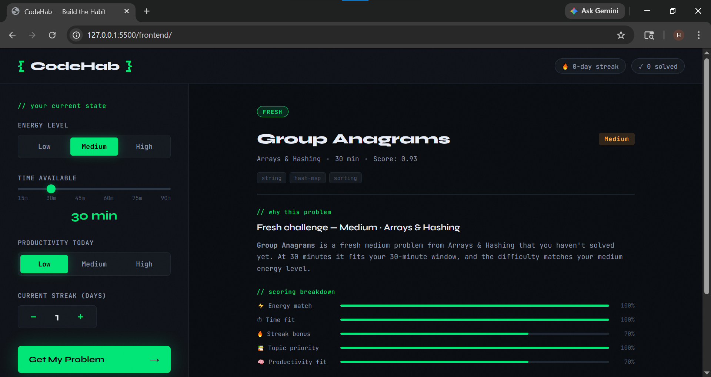
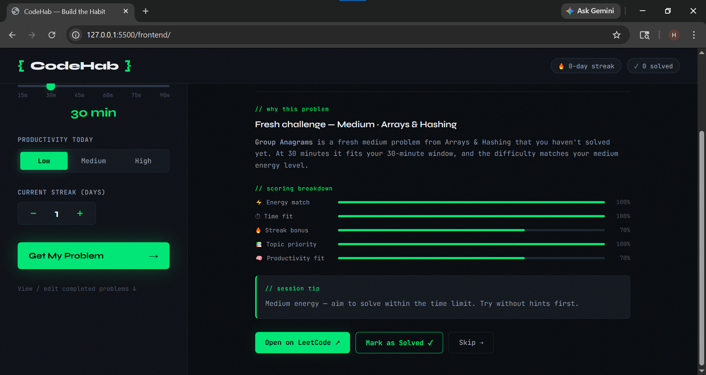

# CodeHab

**CodeHab** is a deterministic coding practice platform that helps users stay consistent by recommending the right coding problem at the right time based on their current energy level, available time, productivity, streak, and progress history.  
It does **not** use an LLM at runtime. Instead, it uses transparent rules, scoring, and topic sequencing to decide what the user should solve next.

---

## Problem Statement

Many learners struggle with consistency when practicing coding problems. They often waste time choosing what to solve next, repeat topics randomly, or pick problems that are too difficult for their current state. **CodeHab** solves this by acting like a structured practice companion. It analyzes the user’s energy level, available time, streak, productivity, and checklist of completed problems, then recommends one suitable problem from a stored problem bank. If no fresh problem fits, it suggests revision problems solved long ago. If no revision fit exists, it moves to the next topic in sequence and recommends a smaller learning step. The system is fully explainable, deterministic, and designed to make coding practice easier, more consistent, and more effective.

---

## Features

- Personalized problem recommendation based on energy level, time available, streak, and productivity  
- Checklist-based progress tracking to avoid repeating recently solved problems  
- Revision mode that suggests problems solved more than 30 days ago  
- Topic progression to guide users through a structured learning path  
- Explainable recommendations with clear reasoning  
- Deterministic intelligence using rules and scoring instead of AI models  
- Clean frontend interface for user interaction  
- Expandable architecture for future improvements  

---

## How It Works

1. The user provides:
   - energy level  
   - time available  
   - streak  
   - productivity  
   - completed problems  

2. The backend processes the input.

3. The rule engine filters problems:
   - removes completed problems  
   - checks time constraints  
   - matches difficulty with energy  

4. The scoring system ranks valid candidates.

5. If no fresh problem exists:
   - the system selects revision problems solved earlier  

6. If no revision candidate exists:
   - the system selects a problem from the next topic  

7. The system returns:
   - one recommended problem  
   - explanation of why it was chosen  

---

## Tech Stack

### Backend
- Python  
- FastAPI  

### Logic Engine
- Rule-based system  
- Scoring system  
- Decision flow  
- Explanation generator  

### Frontend
- HTML  
- CSS  
- JavaScript  

### Data
- JSON (problem bank)  
- LocalStorage (user progress)  
- Optional database support (future)  

---

## File Structure

CodeHab/
├── backend/
│ ├── main.py
│ ├── api/
│ │ └── recommend.py
│ ├── engine/
│ │ ├── constants.py
│ │ ├── rules.py
│ │ ├── scoring.py
│ │ ├── selector.py
│ │ └── explain.py
│ ├── data/
│ │ └── neetcode150.json
│ └── init.py
│
├── frontend/
│ ├── index.html
│ ├── styles.css
│ └── script.js
|
├── screenshots/
│   ├── home.png
│   ├── recommendation.png
│   ├── recommendation2.png
|
└── README.md

---

## Screenshots

### Home Screen

### Recommendation Output

---

## Why This Project Fits the Hackathon

CodeHab aligns perfectly with the **“AI Without the API: Deterministic Intelligence”** theme because:

- It does not rely on LLMs or external AI at runtime  
- All decisions are made using rules, scoring, and structured logic  
- The reasoning is transparent and explainable  
- The system consistently produces deterministic outputs  
- It helps users learn and improve through logic-driven recommendations  

---

## Future Scope

### 1. Learning Resource Integration
- Recommend videos, articles, and tutorials for each topic  
- Include estimated learning time for each resource  
- Suggest learning before solving problems when needed  

### 2. Login and Signup System
- User authentication  
- Personalized dashboards  
- Cross-device syncing  

### 3. Database Integration
- Store user profiles  
- Track solved problems  
- Maintain streaks and history  
- Enable long-term analytics  

### 4. Advanced Intelligence
- Weak-topic detection  
- Burnout detection  
- Adaptive learning paths  
- Spaced repetition system  

### 5. Analytics Dashboard
- Progress graphs  
- Consistency tracking  
- Topic-wise performance  
- Time-based insights  

---

## Notes

- CodeHab uses deterministic logic instead of AI models  
- The recommendation engine is fully explainable  
- The system is designed for clarity, consistency, and real-world usability  

---

## Project Info

**Project Name:** CodeHab  
**Theme:** AI Without the API: Deterministic Intelligence  
**Category:** Learning / Career System  